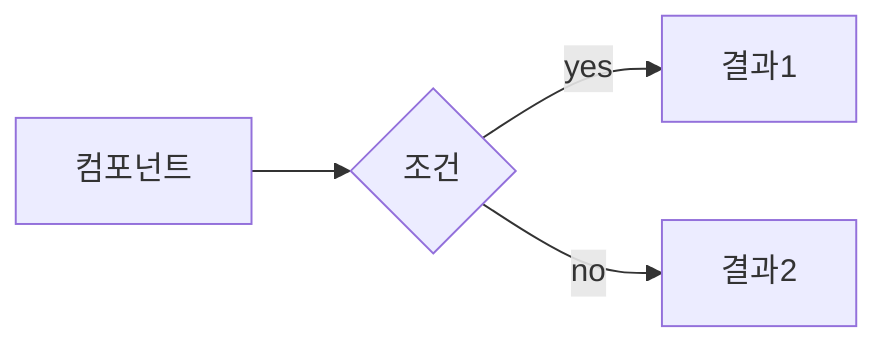
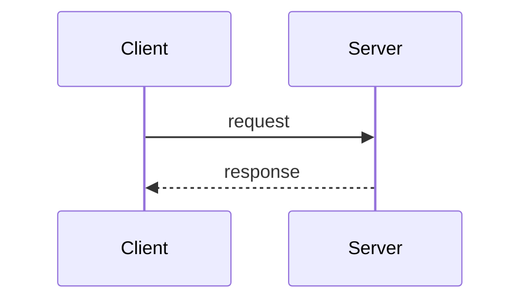

# termaid — Mermaid Terminal Renderer

Mermaid 다이어그램을 터미널에서 스타일링 렌더링하는 CLI.
설계 논의, 아키텍처 설명, 데이터 플로우 시각화 시 자동 발동.

## Install

```bash
# 소스 빌드
cd ~/scripts/termaid && go build -o termaid-render ./cmd/render/
cp termaid-render /opt/homebrew/bin/
```

## Quick Reference

```bash
# stdin 파이프 (가장 흔한 사용)
echo 'graph LR
  A[Client] --> B{Auth}
  B -->|yes| C[OK]' | termaid-render

# 파일에서
termaid-render diagram.mmd

# 도움말
termaid-render --help
```

## Trigger Patterns

### 자동 발동 (Claude 판단)
- 사용자와 **설계를 논의**할 때 (아키텍처, API 설계, DB 스키마)
- **시스템 구조**를 설명할 때 (컴포넌트 관계, 데이터 플로우)
- **코드 흐름**을 시각화할 때 (함수 호출 체인, 이벤트 흐름)
- 사용자가 "그림으로", "다이어그램으로", "시각적으로" 요청할 때

### 명시적 트리거
- "다이어그램", "diagram", "차트", "chart"
- "시퀀스", "sequence", "플로우", "flow"
- "아키텍처", "architecture", "구조도"
- "mermaid", "termaid", "머메이드"
- "시각화", "그려줘", "보여줘"

### 발동 안 함
- 단순 코드 수정/버그 픽스
- 짧은 QA
- 코드블록으로 충분한 경우

## Diagram Type Guide

### Flowchart (`graph LR/TD`) — 가장 빈번
아키텍처, 컴포넌트 관계, 의사결정 흐름



노드: `[box]` `(round)` `{diamond}` `[(cylinder)]` `((circle))`
방향: `LR` 시스템 아키텍처, `TD` 계층/흐름

### Sequence (`sequenceDiagram`) — API/인터랙션
서비스 간 통신, 인증, 이벤트 순서



화살표: `->>` 동기, `-->>` 비동기, `-x` 실패
블록: `loop`, `alt/else`, `opt`, `par`

### Class (`classDiagram`) — 데이터 모델

### State (`stateDiagram-v2`) — 상태 머신

### ER (`erDiagram`) — DB 관계

## Claude 행동 규칙

### MUST
1. 설계 논의 시 **Mermaid 코드블록**을 대화에 포함
2. 복잡한 다이어그램은 **termaid-render Bash 실행**도 제공
3. 다이어그램은 간결하게 — 핵심만

### MUST NOT
1. 20줄 초과 다이어그램 → 분할
2. 10개 이상 노드 → 가독성 저하
3. 코드블록만 두고 설명 없이 끝내지 않기

## Supported Types

| 타입 | 키워드 | 지원 |
|------|--------|------|
| Flowchart | `graph TD/LR`, `flowchart` | O |
| Sequence | `sequenceDiagram` | O |
| Class | `classDiagram` | O |
| State | `stateDiagram-v2` | O |
| ER | `erDiagram` | O |
| Gantt | `gantt` | X (코드블록만) |
