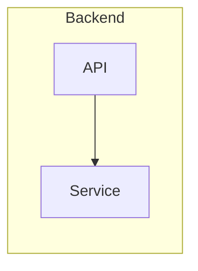
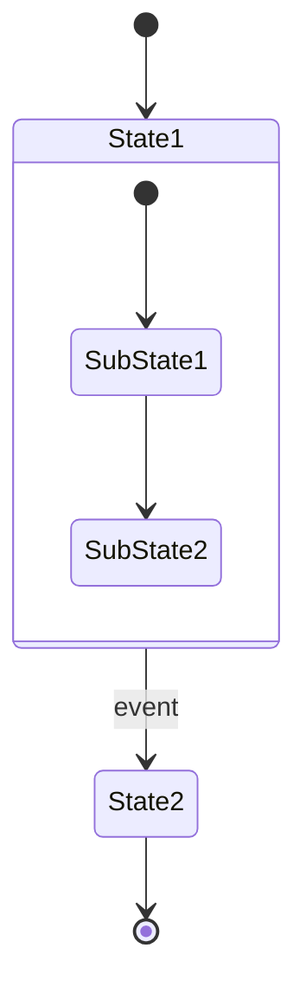
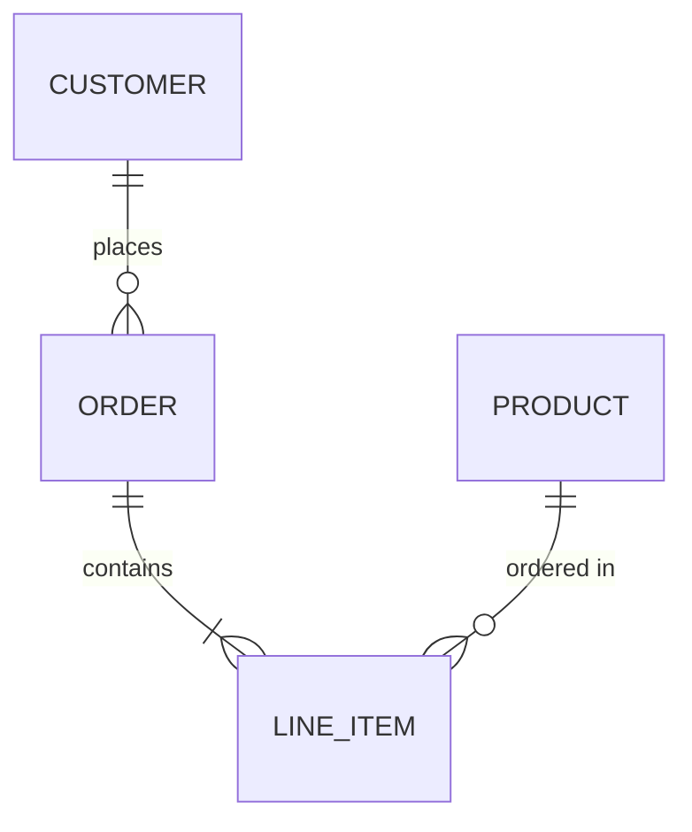

# Mermaid Diagram Type Reference

## Flowchart (graph/flowchart)

**방향:**
- `graph LR` — 좌 → 우 (시스템 아키텍처 권장)
- `graph TD` — 위 → 아래 (계층/흐름 권장)
- `graph BT` — 아래 → 위
- `graph RL` — 우 → 좌

**노드 형태:**
| 문법 | 형태 | 용도 |
|------|------|------|
| `A[text]` | 사각형 | 일반 컴포넌트 |
| `A(text)` | 둥근 사각형 | 프로세스 |
| `A{text}` | 다이아몬드 | 조건/분기 |
| `A[(text)]` | 실린더 | DB/스토리지 |
| `A((text))` | 원형 | 시작/종료 |

**엣지:**
| 문법 | 스타일 |
|------|--------|
| `-->` | 실선 화살표 |
| `-.->` | 점선 화살표 |
| `==>` | 굵은 화살표 |
| `-->\|label\|` | 라벨 포함 |

**서브그래프:**


## Sequence Diagram

**참여자:**
```
participant A as 별칭
actor A as 별칭
```

**화살표:**
| 문법 | 의미 |
|------|------|
| `->>` | 동기 요청 (실선) |
| `-->>` | 비동기 응답 (점선) |
| `-x` | 실패/차단 |
| `--x` | 비동기 실패 |

**블록:**
```
loop 반복조건
  ...
end

alt 조건1
  ...
else 조건2
  ...
end

opt 선택
  ...
end

par 병렬1
  ...
and 병렬2
  ...
end
```

## Class Diagram

```mermaid
classDiagram
  class ClassName {
    +publicField type
    -privateField type
    #protectedField type
    +publicMethod() returnType
  }
  ClassA <|-- ClassB    %% 상속
  ClassA *-- ClassC     %% 합성
  ClassA o-- ClassD     %% 집합
  ClassA --> ClassE     %% 연관
  ClassA ..> ClassF     %% 의존
```

## State Diagram



## ER Diagram



**관계:**
| 문법 | 의미 |
|------|------|
| `\|\|--o{` | 1:N (one to many) |
| `\|\|--\|{` | 1:N (필수) |
| `o\|--o{` | 0..1:N |
| `\|\|--\|\|` | 1:1 |
